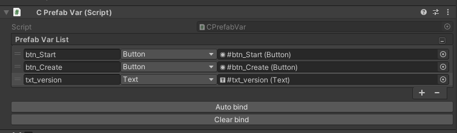
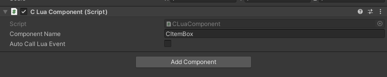

## Getting Started

（1）参考LoginPanel为例，创建Assets/res/Prefabs/UI/LoginPanel.prefab。

（2）添加CPrefabVar组件，设置变量名称，类型，拖拽相应节点到编辑器赋值。此变量名称在lua里面可通过self.xxx访问。


（3）进入Assets\Scripts\Lua目录，用VSCode打开。在Common/LuaUiNames.lua里定义UI的名字Login = 'Login',然后在CtrlManager里面添加UIself:AddCtrl(UiNames.Login, require "UIController.UILoginCtrl")。

（4）在UIController目录下新建UILoginCtrl.lua文件，UI逻辑在此类，类继承自UIBaseCtrl。此类要固定重写Awake()\OnCreateOK()函数，在此类中可以通过self.xxx访问上面定义的变量。UI的对象self.gameObject。

```lua
local UIBaseCtrl = require "UIController/UIBaseCtrl"
local UILoginCtrl = class("UILoginCtrl", UIBaseCtrl)

function UILoginCtrl:Awake()
	self.loginCtrl = nil
	self.moduleMgr = MgrCenter:GetManager(ManagerNames.Module)
	self.userModule = self.moduleMgr:GetModule(ModuleNames.User)
	self.panelMgr = MgrCenter:GetManager(ManagerNames.Panel)
	self.panelMgr:CreatePanel(self, UILayer.Common, UiNames.Login, self.OnCreateOK)
	logWarn("UILoginCtrl.Awake--->>")
end

--启动事件--
function UILoginCtrl:OnCreateOK()
	self:RegEvents()
	local adapterMgr = MgrCenter:GetManager(ManagerNames.Adapter)
	self.loginCtrl = adapterMgr:GetAdapter(LevelType.Login)

	self.behaviour:AddClick(self.btn_Start, self, self.OnStartClick)
	self.behaviour:AddClick(self.btn_Create, self, self.OnCreateClick)

	local rect = self.gameObject:GetComponent('RectTransform')
	if rect ~= nil then
		rect.anchorMin = Vector2.zero
		rect.anchorMax = Vector2.one
		rect.sizeDelta = Vector2.zero
		rect.anchoredPosition3D = Vector3.zero
	end
	self.txt_version.text = LuaHelper.GetVersionInfo()

	PlayerPrefs.DeleteKey("roleid")
	self:CheckExistCharacter()
	logWarn("OnCreateOK--->>"..self.gameObject.name)
end

function UILoginCtrl:RegEvents()
	AddEvent("login.onRefreshUI", function (...)
		local argv = {...}
		self:OnRefreshLoginOK(argv[1]) 
	end)
end

function UILoginCtrl:UnregEvents()
	RemoveEvent("backpack.onRefreshUI")
end
```

（5）在Module文件夹下可以新建数据模块，里面可以处理数据、网络消息等于UI不相干的逻辑。

（6）在Manager创建功能逻辑性较独立的管理器。比如网络管理器、关卡管理器、地图管理器等。

（7）在Handler下面写网络消息映射Map类，比如自带的UserMsgHandler.lua里定义与用户相关的网络消息，然后通知Module模块数据更新。

（8）Data目录是tabletool.exe自动生成的目录文件，可以通过TableManager访问表格数据，里面文件不要手改，切记！<br/>
访问Global表的KeyValue数据如下简化代码：
```lua
local colorItem = getGlobalItemByKey("CommonWhite")
logWarn('Main.OnInitOK--->>>'..colorItem.value)
```
遍历表格数据代码如下：
```lua
local tableMgr = MgrCenter:GetManager(ManagerNames.Table)
local items = tableMgr.npcTable:GetItems()
local iter = items:GetEnumerator()

while iter:MoveNext() do
	local npcItem = iter.Current
	if not npcItem.isMainCharacter then
		local item = {
			name = npcItem.name,
			itemid = npcItem.itemid,
		}
		table.insert(self.mHeroDataList, item)
	end
end
```
通过Key获取道具表数据
```lua
local tableMgr = MgrCenter:GetManager(ManagerNames.Table)
local itemData = tableMgr.itemTable:GetItemByKey(index)
if itemData then
	prefabVar:SetText("txt_TextName", itemData.name)

	local itembox = prefabVar:TryGetComponent('itembox_icon')
	if itembox ~= nil then
		itembox:SetItem(itemData.id)
	end
end
```

（9）Controller目录下面是非UI的控制器，比如GM指令、预加载、红点等。

（10）Component目录下面是定义的LuaComponent，里面最常用的便是CItemBox组件，它可以适配游戏所有的ICON显示，用法是在Prefab上拖拽一个UI/ItemBox，然后添加CLuaComponent组件，并且在上面添上CItemBox即可。


（11）Adapter目录下面是定义的关卡适配器，比如战斗关卡、Login关卡、主关卡等。
