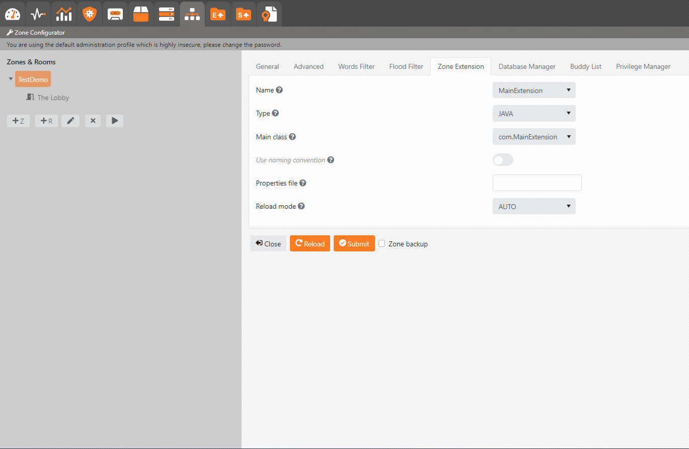

## Getting Started

（1）设置环境变量 JAVA_HOME

（2）设置Path下添加%JAVA_HOME%\bin

（3）VSCode打开服务器工程。

（4）设置引用的jar包路径，protobuf-java-3.5.1.jar    sfs2x-core.jar     sfs2x.jar

（5）若新建工程，工程的主类必须以 *Extension形式，否则会无法辨认！！

（6）运行enumtool.exe生成前后端（C#+JAVA）公用的枚举类型。

（7）运行protoname.exe生成前后端（C#+JAVA）公用的消息名称。

（8）修改publish.bat里面SFS_Path的安装路径。

（9）使用publish.bat发布到sfs的extensions目录下，重启sfs即可运行。

（10）新建扩展步骤登录http://localhost:8080后台后，然后如图所示：




（11）为了便于框架升级，开发者推荐在GameLogic下写自己的逻辑。

```java
public class LoginHandler extends BaseHandler {
    @Override
    public void OnMessage(User user, byte[] bytes) {
        ///解析客户端数据
        Person person = null;
        try {
            person = Person.parseFrom(bytes);
        } catch (InvalidProtocolBufferException e) {
            e.printStackTrace();
        }
        if (person != null) {
            logMgr().Trace("Person Count: " + person.getName());
        }

        ///从数据库初始化数据
        UserEntity userEntity = new UserEntity("10000");
        if (userEntity != null) {
            userEntity.Initialize();
        }
        
        ///发送reply数据
        UserInfo info = UserInfo.newBuilder()
            .setUserid("10000")
            .setName("张三")
            .setMoney(999999)
            .build();
        ResLogin login = ResLogin.newBuilder()
            .setUserinfo(info)
            .build();
        SendData(user, ProtoType.LuaProtoMsg, Protocal.ResLogin, login);
    }
}
```