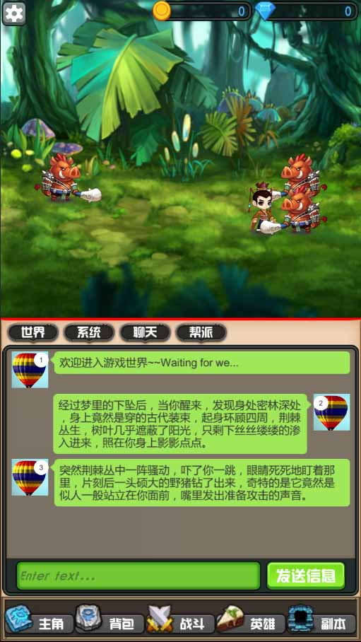
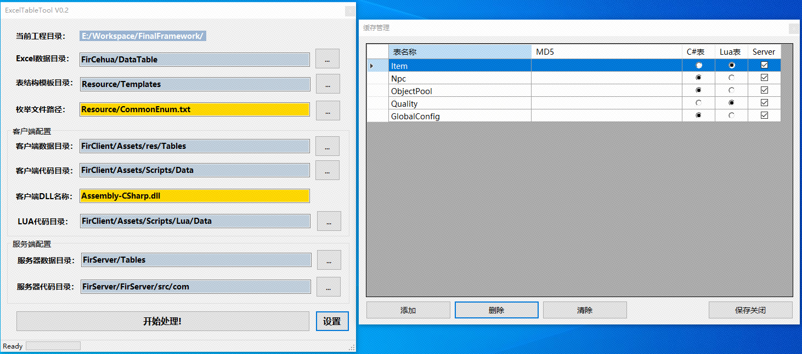

<table>
	<tbody>
	<tr>
	<td align="center" width="150px">

	</td>
	<td>
#### 开发目标 <br/>
FinalFramework（简称FF）的目标是打造独立游戏开发的闭环，从客户端、服务器端+DB、各种独立工具链（剧情编辑器、打表、ProtoBuff等）(项目素材禁止商用！！)

	
#### 运行环境（版本太低的需要自力更生了）<br/>
FirClient： Unity 2019.4.40f1 (64-bit) + Visual Studio 2019  <br/>
FirServer:  Smartfoxserver + MongoDB 4.29 + MySQL 5.7 + Redis 5.0.14.1 + VSCode  <br/>
FirToolkit: Visual Studio 2019 
	</td>
	</tr>
	</tbody>
</table>

<a href="https://pan.baidu.com/s/1U7jD7KyJwNajkspYW7F5uw?pwd=bpkb" target="_blank">Smartfoxserver相关软件 - 网盘下载===!!!</a><br/>
<a href="https://www.cnblogs.com/code-boy/p/4883402.html">SmartFoxServer Extension调试</a><br/>

#### 框架工具介绍：
（1）enumtool.exe 双端(C#/JAVA)共用枚举工具生成器，枚举类型定义在<a href="Resource/Enum.txt">Resource/Enum.txt</a>，生成代码路径：<br/>
```csharp
static void ParseConfig()
{
	javaTemplate = Environment.CurrentDirectory + "\\Resource\\Templates\\JavaEnum.txt";
	csharpTemplate = Environment.CurrentDirectory + "\\Resource\\Templates\\C#Enum.txt";

	javaCodePath = Environment.CurrentDirectory + "\\FirServer\\FirServer\\src\\com\\tables\\enums";
	csharpCodePath = Environment.CurrentDirectory + "\\FirClient\\Assets\\Scripts\\Data\\Enums";
}
```
（2）protoname.exe 双端(C#/JAVA)共用网络协议名生成器，文件定义在<a href="Resource/Protocal.txt">Resources/Protocal.txt</a>，生成代码路径：<br/>
```csharp
static void ParseConfig()
{
	javaTemplate = Environment.CurrentDirectory + "\\Resource\\Templates\\JavaProtocal.txt";
	csharpTemplate = Environment.CurrentDirectory + "\\Resource\\Templates\\C#Protocal.txt";

	javaCodePath = Environment.CurrentDirectory + "\\FirServer\\FirServer\\src\\com\\common\\Protocal.java";
	csharpCodePath = Environment.CurrentDirectory + "\\FirClient\\Assets\\Scripts\\Network\\Protocal.cs";
}
```
（3）protos.bat 双端(C#/JAVA)共用网络协议（ProtoBuff3）生成器，文件定义在Protos子目录里面。<br/>
（4）storyeditor.exe 剧情编辑器。<br/>
（5）tabletool.exe 双端(C#/JAVA)共用Excel表格生成器。<br/>

#### 框架工作流使用介绍：	
（1）proto添加消息，定义req、res结构，打协议（自动copy到客户端、服务器端pb目录） <br/> 
（2）在策划Excel目录定义数据表，然后打表（自动copy到客户端+服务器Table目录） <br/> 
（3）在FirServer里添加对于模块Handler（消息），Model（数据库），Manager（管理器） <br/> 
（4）在前端lua添加MsgHandler，Module，Manager，就可以接入View逻辑了。<br/>
（5）<a href="FirClient/README.md">客户端开发工作流指南</a>。<br/>
（6）<a href="FirServer/README.md">服务器端开发工作流指南</a>。<br/>
（7）客户端设置里面Assets/Resources/GameSettings.asset，NetworkMode默认开启，若不需要SFS关闭即可。<br/>
（8）tabletool.exe打表工具生成双端代码，双端数据文件路径，打开工具即可查看，如图所示：


#### 2023.03.18 更新日志：
（1）去掉自带的FirServer，支持Smartfoxserver。

#### 2021.02.23 更新日志：
（1）开源多端共享工程FirCommon，公共定义都放此工程。

#### 2021.02.20 更新日志：
（1）升级打表工具TableTool V2。
（2）升级剧情编辑器StoryEditor V2。 

#### 2021.02.11 更新日志：
（1）梳理了前后端通讯流程，客户端工程设置里面有“NetworkMode”,默认关闭。 

#### 框架特征：
（0）采用tolua53分支代码(lua5.3.5版本) + pbc3.0 + sproto最新版。    
（1）逻辑层、视图层代码分离，中间使用消息组件通信消息，可以完全隔离。  
（2）仿照UE4+Unlua的蓝图式组件访问方式，彻底抛弃了Lua View层导出代码，代码简洁性能更好。  
（3）Lua层代码OOP架构方式，完全的单向访问（Lua->C#）避免交叉访问带来的弊端。  
（4）基于DLL插件式的配套服务器端框架，游戏只需要封装到一个程序集，完全不入侵的服务器端框架。  
（5）完善的Excel打表工作流工具，你可以直接根据打表规则，生成客户端表结构、服务端表结构。  
（6）完善的Protobuf生成工作流工具，你可以生成客户端（C#+LuaPB），服务器端C#。  
（7）一个可以用于开发独立游戏的独立于Unity3D的剧情编辑器。  
（8）Lua层的自定义组件库，你可以完全不需要修改C#的情况下，新增或者修改自定义组件。  
（9）可视化的资源打包管理系统。  
（10）可视化资源导入管线设置。  
（11）场景事件管理系统，整个框架的战斗完全是基于场景事件驱动。  
（12）一个简单版本的Patch系统。  
（13）红点系统（实现一个红点通用框架）。  作者：DustYang

#### 已知问题
（1）英雄战斗状态机会停下。（已修复）npcData.skillConsume决定是否要释放技能。  <br/>
（2）Unity高版本的Visual Scripting会跟项目自带的ZIP组件冲突，可选要移除一个。<br/>
（3）SFS安装启动后，中文乱码解决办法:登录后台管理http://localhost:8080，进入Administration Tool 2X后，用户名+密码：sfsadmin，Server Configurator/JVM Settings/设置成-Dfile.encoding=GBK，重启即可。<br/>
